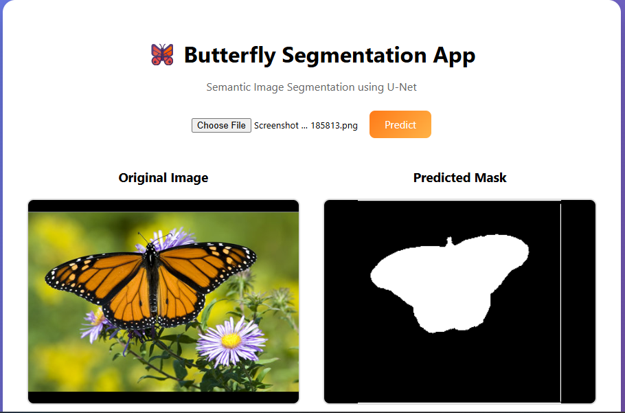

# 🦋 Semantic Image Segmentation of Butterfly Images using U-Net
[](https://www.python.org/)
[](https://www.tensorflow.org/)
[]()
[](https://fastapi.tiangolo.com/)
[]()
[]()
[]()
[]()
[]()
[]()


This project implements a **Computer Vision–based semantic image segmentation system** to accurately extract butterfly regions from complex backgrounds at the **pixel level**.  
The solution uses a **U-Net architecture**, deployed as a **real-time web application** using **FastAPI**, **HTML/CSS/JavaScript**, **Docker**, and **Hugging Face Spaces**.

---

# 🚀 Demo
You can try the **real-time Butterfly Semantic Segmentation** application here:

[](https://huggingface.co/spaces/Atish020/butterfly-semantic-segmentation-unet)
- Upload a butterfly image  
- Get **real-time segmentation mask**
- View **original image & predicted mask side-by-side**


The application runs fully inside a Docker container and exposes a FastAPI backend for inference.

---

## 📌 Problem Statement

Traditional object detection methods provide only bounding boxes, which are insufficient for tasks requiring precise object boundaries.  
Butterfly images pose additional challenges due to:
- Complex and cluttered backgrounds (flowers, leaves, sky)
- Color similarity between butterfly wings and background
- Fine-grained wing structures

The goal is to **classify each pixel** as either:
- Butterfly (foreground)
- Background

---

## 🧠 Proposed Solution

This problem is solved using **Semantic Image Segmentation** with a **U-Net architecture**, which combines:
- Encoder path for contextual feature extraction
- Decoder path for precise spatial localization
- Skip connections to preserve fine details

The trained model predicts a **binary segmentation mask** highlighting only the butterfly region.

---

## 🧩 Model Architecture

- **Architecture**: U-Net
- **Input size**: 256 × 256 × 3
- **Loss Function**: Binary Cross-Entropy
- **Metrics**: Accuracy, Dice Coefficient, Mean IoU
- **Framework**: TensorFlow / Keras

---

## 📊 Performance

- **Validation Accuracy**: ~96%
- **Mean IoU (Validation)**: ~0.89
- **Dice Coefficient**: ~0.94
- **Inference Time**: ~100 ms per image (CPU)

---

## 🗂️ Dataset

**Leeds Butterfly Dataset (BMVC 2009)**  
- 832 butterfly images
- Pixel-level segmentation masks
- 10 butterfly species
- Images collected from Google Images and manually filtered

---

## 🧱 Project Structure

```text
Semantic-image-segmentation-using-UNet/
│
├── app.py
├── Dockerfile
├── requirements.txt
├── README.md
│
├── backend/
│   └── main.py        # FastAPI backend logic
│
├── frontend/
│   ├── index.html     # UI
│   ├── style.css      # Styling
│   └── script.js      # Client-side logic
│
├── saved_model/
│   └── final_UNET_Butterfly_Segmentation.keras
